<div align="center">

# 🐜 Turing Explorer

### Secuenciador Musical de la Hormiga de Langton


*Aplicación TypeScript/p5.js que transforma el autómata celular de la Hormiga de Langton en composiciones musicales mediante salida MIDI.*


</div>

---

## 📖 Descripción General

Este proyecto explora el potencial sonoro de la **Hormiga de Langton**, una máquina de Turing 2D que exhibe comportamiento complejo emergente a partir de reglas simples. Los patrones que emergen—autopistas, simetrías, rotaciones y colisiones—se traducen naturalmente en estructuras musicales.

---

## 🎵 ¿Por Qué la Hormiga de Langton es Musical?

| Característica del Patrón | Equivalente Musical |
|:--------------------------|:--------------------|
| 🔄 **Periodicidad de autopista** | Motivos repetitivos y loops |
| 🪞 **Simetría/Inversión** | Articulación de tema y retrógrado |
| ↻ **Rotaciones** | Transposiciones a diferentes grados de escala |
| 💥 **Colisiones** | Polirritmias y ritmos cruzados |

---

## 🎹 Estrategias de Mapeo Sonoro

### 1. Estado de Celda → Altura

Cada estado de celda se mapea a una nota. Cuando una celda cambia de estado, suena su altura correspondiente.

### 2. Dirección Absoluta → Altura

La dirección que enfrenta la hormiga (N/E/S/O) dispara notas específicas—funciona como transposición modal.

### 3. Aplicación de Regla → Percusión

Los giros Izquierda/Derecha se mapean a samples de batería, capturando el patrón rítmico de la regla.

---

## 🥁 Técnicas Rítmicas

- **Disparar solo en cambio**: Omitir valores repetidos para ritmo natural
- **Estado inicial silencioso**: Mapear estado 0 a silencio, creando espacio para respirar

---

## 🔷 Geometrías de Grilla

| Tipo | Direcciones | Caso de Uso |
|:-----|:-----------:|:------------|
| ⬜ **Cuadrado (4 vías)** | N/E/S/O | Hormiga de Langton clásica |
| ⬛ **Cuadrado (8 vías)** | +Diagonales | Patrones de autopista más ricos |
| 🔺 **Triangular** | 6 direcciones | Simetrías inusuales |
| ⬡ **Hexagonal** | 6 direcciones | Bellos patrones rotacionales |

---

## 🗂️ Estructura del Proyecto

```
src/
├── Machine.ts      # Lógica del autómata (Grid, Machine, Rules)
├── sound.ts        # Mapeo de sonido MIDI (SoundPlayer)
├── drawing.ts      # Visualización p5.js
├── presets.ts      # Sistemas de reglas preconfigurados
├── colorSchemes.ts # Paletas visuales
├── ui.ts           # Controlador de interfaz de usuario
└── index.ts        # Punto de entrada
```

---

## 🚀 Inicio Rápido

```bash
npm install
npm start    # Abre navegador con visualización + salida MIDI
```

> [!IMPORTANT]
> **Requiere**: Un destino MIDI (hardware o virtual como loopMIDI)

---

## ⚙️ Creando Presets

```typescript
const miPreset: Preset = {
  systemConfig: {
    numDirs: 4,
    numCols: 64,
    numRows: 64,
    numStates: 4,
    sides: Sides.Four,
    rule: langtonsAntFactory([-1, 1, 1, -1]), // LRRL
  },
  bpm: 120,
  statePlayer: {
    channel: 1,
    mapping: [0, 2, 4, 7], // Intervalos pentatónicos
    ignoreZero: true,
    rootNote: 60,
  },
};
```

---

# 📋 Plan de Implementación

## Estado Actual

El proyecto tiene:

- **Lógica central** en `Machine.ts` - autómata de Langton completamente funcional
- **Sistema de sonido** en `sound.ts` - salida WebMIDI funcionando
- **Visualización** en `drawing.ts` - renderizado p5.js para grillas cuadradas/hex/triangulares
- **Presets** en `presets.ts` - sistemas de reglas preconfigurados

**Objetivo**: Conectar la UI HTML con el código TypeScript para control interactivo.

---

## 🔧 Cambios Propuestos

### Controlador UI

#### `ui.ts` [NUEVO]

- Parsear strings de reglas ("LR" → `[-1, 1]`, "LRRL" → `[-1, 1, 1, -1]`)
- Mapear dropdown de tipo de grilla al enum `Sides`
- Manejar estado play/pause
- Actualizar display del contador de pasos
- Disparar animaciones del indicador de sonido

### Refactor Punto de Entrada

#### `index.ts` [MODIFICAR]

- Agregar `AppState` global con flags `isPlaying`, `isPaused`
- Montar canvas en `#canvas-container` en lugar de `document.body`
- Agregar event listeners para todos los controles UI

---

# ✅ Lista de Tareas

## Fase 1: Conectar UI con Funcionalidad Central

- [x] Crear módulo controlador UI para conectar controles HTML con TypeScript
- [x] Implementar controles de transporte Play/Pause/Reset
- [x] Conectar slider BPM a función `bpmToFrameRate()`
- [x] Conectar input de Regla (parsear "LR", "LRRL" etc) a `langtonsAntFactory()`
- [x] Conectar selector de Tipo de Grilla para cambiar entre `Sides.Four`, `Sides.Six`, `Sides.Eight`

## Fase 2: Refactorizar Punto de Entrada

- [x] Refactorizar `index.ts` para usar estado global de la app
- [x] Agregar event listeners para todos los controles UI
- [x] Implementar actualización del display del contador de pasos
- [x] Agregar montaje del contenedor del canvas

## Fase 3: Integración del Indicador de Sonido

- [x] Conectar visualización de dots de sonido con triggers de notas MIDI reales
- [x] Agregar feedback visual cuando se tocan notas

## Fase 4: Testing y Verificación

- [ ] Ejecutar tests existentes (`npm test`)
- [ ] Testing manual en navegador de todos los controles
- [ ] Verificación de salida MIDI

---

# 📚 Teoría: Hormiga de Langton y Música

<div align="center">

</div>

## Variaciones de las Hormigas de Langton

### ¿Qué es la Hormiga de Langton?

La Hormiga de Langton es un autómata celular creado por **Chris Langton en 1986**. Explora la idea de una vida, es decir, la vida artificial o la vida tal como 'podría ser'. Lo veo como un experimento mental que demuestra que los comportamientos complejos en el universo no siempre son el resultado de sistemas complejos; A veces, sistemas, reglas o comportamientos increíblemente simples, cuando se escalan, pueden crear comportamientos emergentes fascinantemente complejos. Piensa en copos de nieve, aves en bandada, el crecimiento de las plantas y, por supuesto, las hormigas.

---

### ¿Cómo funciona?

El modelo original de Langton funciona algo así: empezamos con una cuadrícula de celdas y un agente o cursor llamado 'la hormiga'. Cada celda puede tener uno de dos estados posibles, llamémoslos 'blanco' y 'negro'. La hormiga mira hacia una de las cuatro direcciones cardinales. El modelo avanza por etapas. Esto es lo que ocurre en cada paso:

1. Si la celda en la que está la hormiga es **blanca**, la hormiga da un cuarto de vuelta a la **derecha**; Si la celda es **negra**, la hormiga da un cuarto de vuelta a la **izquierda**
2. La célula cambia de estado; es decir, si la celda es blanca, se vuelve negra y si es negra se vuelve blanca
3. La hormiga avanza en la dirección en la que mira hacia una celda adyacente

<div align="center">


*Fase 1: Animación de los primeros 200 pasos (de Wikipedia)*
</div>

---

### ¿Qué pasa?

Aquí es donde se pone interesante. A lo largo de iteraciones repetidas de la regla, la hormiga avanza por **tres etapas**:

| Etapa | Descripción |
|:-----:|:------------|
| **1** | Al principio se comporta de forma algo sistemática, haciendo cambios de forma aparentemente simétrica. Esto continúa durante unos cientos de pasos |
| **2** | Entonces 'se rompe', por falta de una mejor forma de decirlo. Se comporta de forma caótica, cambiando celdas de un estado a otro en una fasión pseudoaleatoria durante aproximadamente las siguientes ~10.000 iteraciones |
| **3** | Luego viene 'la autopista': crea la condición para un ciclo periódico (104 pasos) que se autorreplica y continuará hasta el infinito |

<div align="center">
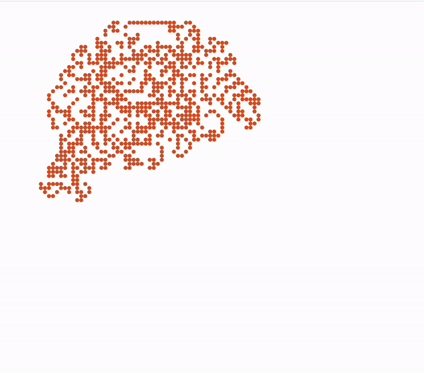

*Etapa 3: Hormiga de Langton alrededor del paso 10.300, justo después de que empiece su autopista*
</div>

---

## 🔄 Ampliando el Modelo: Instrucciones y Estados

El modelo de Langton hace que la hormiga gire a la izquierda o a la derecha. Hay cuatro direcciones cardinales, así que realmente la hormiga podría girar a la izquierda, derecha, mantener la dirección a la que mira o girar 180 grados. Me referiré a estas indicaciones como:

| Símbolo | Significado |
|:-------:|:------------|
| **L** | Giro a la izquierda |
| **R** | Giro a la derecha |
| **N** | Sin cambio (no change) |
| **B** | 180° (back) |

Además, el modelo de Langton solo tenía dos estados para las celdas, pero no hay razón para limitarlo a dos. Las celdas de un sistema podrían tener, en teoría, un número arbitrario de estados y podemos asignar un color arbitrario a cada estado. Cada estado tiene una 'regla', es decir, una rotación relativa que debe aplicarse a la hormiga, y cuando la hormiga entra en esa celda, aplicamos la regla.

Necesitamos avanzar el estado de una célula cuando la hormiga entra. Supongamos que cada estado está designado por un valor entero. Si tenemos tres estados, avanzará de `0 → 1 → 2 → 0 → 1` y así sucesivamente: el orden es fijo, pero siempre volverá al inicio después del último estado.

Podríamos hacer una regla con 3 estados: **R, L, B**. El primer estado (blanco) hace que una celda gire 90° a la derecha, el segundo (naranja) gire a la izquierda 90°, y el tercero (marino) 180° alrededor:

<div align="center">


*Los primeros cincuenta y pico pasos para la regla RLB `[1,-1,2]`*
</div>

El espacio de reglas es infinitamente grande, y la mayoría de las reglas simplemente se comportan de forma caótica, pero hay comportamientos realmente fascinantes para algunas reglas cuando se les da tiempo y espacio suficientes para iterar:

<div align="center">
<table>
<tr>
<td align="center">


*Regla LRRRRRLLR en ~80.000 pasos*
</td>
<td align="center">
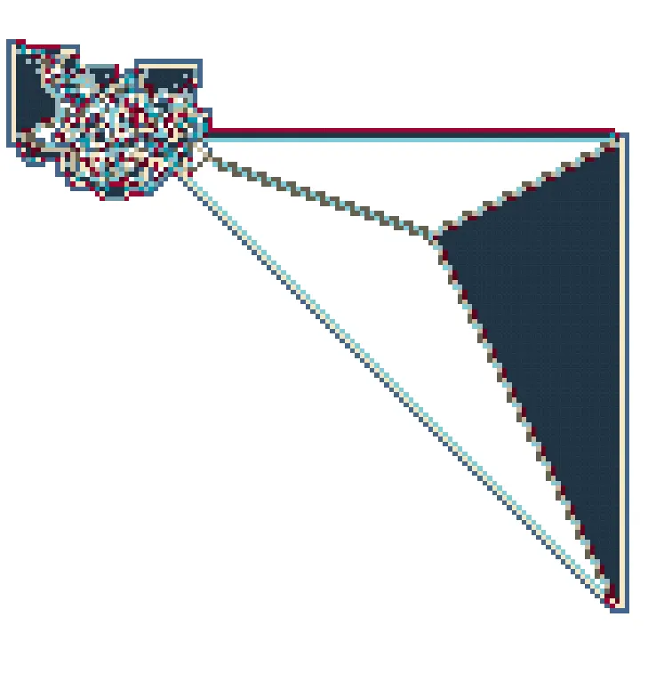

*Regla RRLLLLLLRRRRR a ~60k pasos*
</td>
</tr>
</table>
</div>

---

## ⬡ Ampliación del Modelo: Teselado Hexagonal y Triangular

Naturalmente pensamos en cuadrículas cuadradas simples para autómatas celulares, pero si cambiamos la geometría obtenemos resultados diferentes.

Necesitamos ajustar un poco la notación. Una hormiga en una cuadrícula cuadrada tenía cuatro direcciones posibles, y en una cuadrícula hexagonal, tiene **seis**. Podemos movernos a la izquierda o a la derecha 60° o 120°:

| Notación | Ángulo |
|:--------:|:------:|
| ±1 (R1/L1) | 60° |
| ±2 (R2/L2) | 120° |
| 0 (N) | Sin cambio |
| ±3 (B) | 180° |

<div align="center">


*Los primeros ~100 pasos de la Regla Hexagonal RL `[1,-1]`*
</div>

Algunas reglas de cuadrícula hexagonal pueden proporcionar buenos ejemplos de comportamientos rotacionales a gran escala:

<div align="center">
<table>
<tr>
<td align="center">
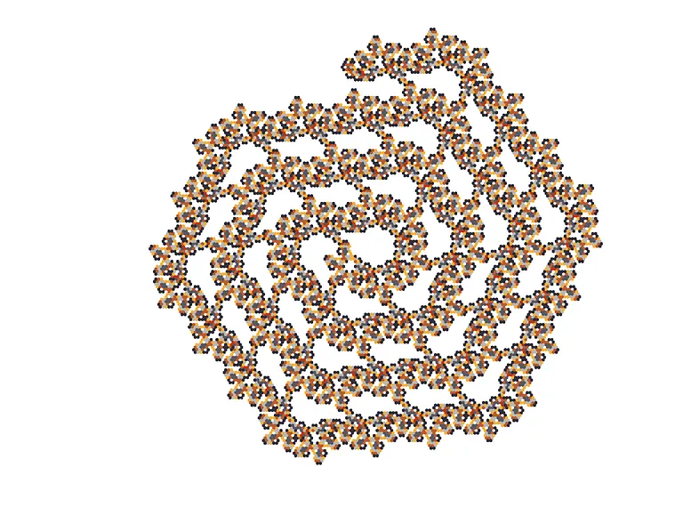

*Regla L1 L2 N U L2 L1 R2, ~80k pasos*
</td>
<td align="center">
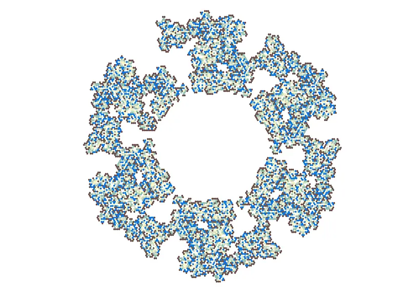

*Regla L2 N N L1 L2 L1*
</td>
</tr>
</table>
</div>

---

### 🔺 Mosaico Triangular

También es posible el mosaico con triángulos. Con los triángulos, como con los hexágonos, hay 6 direcciones posibles — pero solo hay tres disponibles para cada orientación (ten en cuenta que los triángulos siempre apuntarán en una de dos direcciones).

<div align="center">


*Los primeros ~100 pasos de la regla triangular RL `[1,-1]`*
</div>

Si miras los dos gifs anteriores de RL hexagonal y RL triangular, notarás que en realidad forman el mismo patrón. Los hexágonos que solo giran 60°, -60° y 180° en realidad se comportan como si estuvieran en una cuadrícula triangular, formando un 'panal':

<div align="center">
<table>
<tr>
<td align="center">
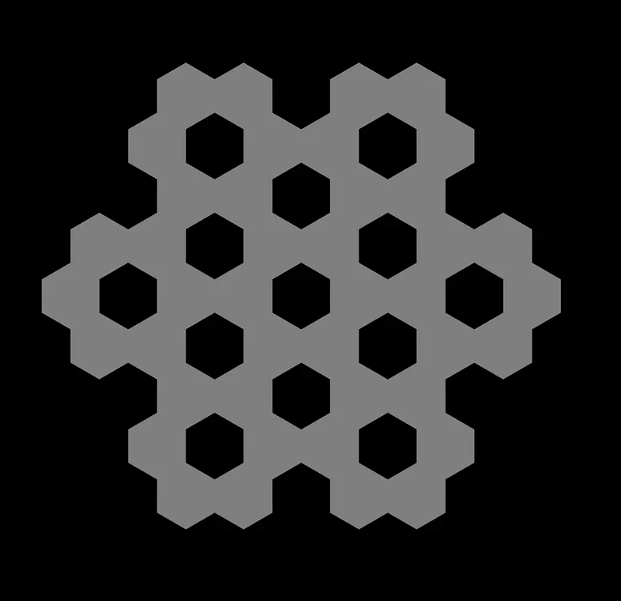

*Patrón en forma de panal*
</td>
<td align="center">
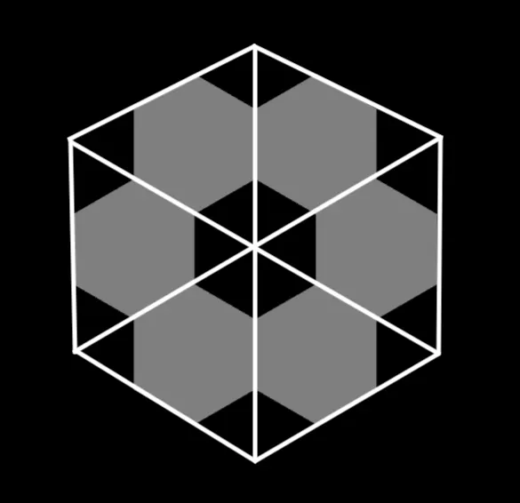

*División triangular*
</td>
</tr>
</table>
</div>

---

### ↗️ Cuadrícula Cuadrada con Diagonales

También podrías usar la cuadrícula cuadrada pero permitir reglas con movimiento diagonal. Las hormigas pueden moverse en ángulos de 45° además de los ángulos rectos.

<div align="center">


*La cuadrícula cuadrada con diagonales: regla LR (giros de 45°)*
</div>

---

## 🐜🐜 Ampliando el Modelo: Múltiples Hormigas

¿Por qué limitar el sistema a un solo agente? Podría haber tantas hormigas como quieras, cada una interactuando con la otra. Las cosas se complican muy rápido cuando una hormiga crea estados para otra.

<div align="center">
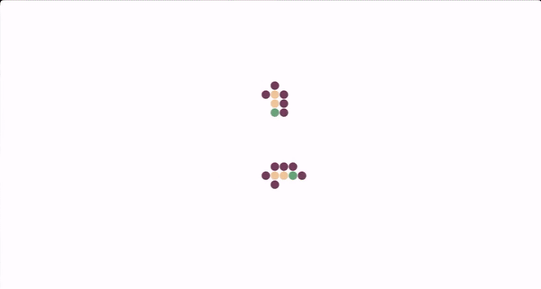

*Dos hormigas con la regla de 8 vías: R3 L2 U R2 L3 R1*
</div>

---

# 🎼 Patronado Musical

## ¿Qué es 'Musical' en los Autómatas Celulares tipo Hormiga de Langton?

Hay algunas características en los patrones que emergen que los hacen candidatos interesantes para la sonificación musical:

| Característica | Potencial Musical |
|:---------------|:------------------|
| **Periodicidad de autopistas** | Se traduce bien en motivos y patrones repetidos |
| **Interacción con autopistas existentes** | Teje nuevos patrones con diferentes periodicidades |
| **Simetría y simetría inversa** | El patrón se articula y luego se 'deshace' (retrógrado) |
| **Rotaciones** | Funcionan como transposiciones en diferentes grados de escala |

---

## 🎯 Estrategias para Mapear Patrones al Sonido

### 1. Mapear el Estado de la Celda

Cada vez que una celda cambia de estado, podemos reproducir una nota o una muestra que corresponda a ese estado. El avance de los estados celulares es donde se forman los patrones más interesantes e insistentes. Además, es perceptualmente relevante: crea la correlación más fuerte entre lo que vemos y lo que escuchamos: **cada color tiene su propio sonido**.

<div align="center">
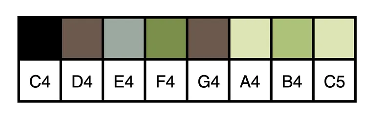

*Un mapeo de pitch uno a uno para 8 estados*
</div>

---

### 2. Mapear la Dirección Absoluta de la Hormiga

Cada dirección posible de la hormiga se asigna a un tono o muestra. Las rotaciones pueden funcionar como transposiciones cuando mapeamos la dirección: el mismo patrón pero empezando en un grado de escala superior.

<div align="center">
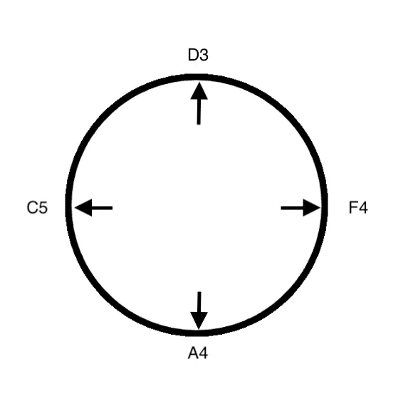

*Un ejemplo de cómo mapear 4 direcciones a 4 alturas*
</div>

---

### 3. Mapear la Aplicación de la Regla (Cambio de Dirección)

Mapeamos un tono o muestra a cada dirección posible de nuestra cuadrícula, pero analizamos el **cambio de dirección** dado por la regla, no la dirección absoluta. Este enfoque funciona mejor con samples que con tonos debido a la paleta más pequeña.

> [!TIP]
> Una de las razones por las que estos sistemas son tan ricos en patrones sonoros es que **no tenemos que elegir** entre las diferentes estrategias. Cada enfoque captura un aspecto importante del patrón emergente general.

---

### Otros Candidatos para Mapeo

- **'Masa total del sistema'** — La suma del valor numérico de los estados de las celdas. Útil como parámetro tímbrico con filtros y efectos.
- **Posición absoluta de la hormiga** — Las coordenadas X e Y pueden asignarse a parámetros sonoros como filtros.

---

## 🎵 Aproximando el Ritmo

Los autómatas celulares suelen generar un evento en cada iteración, lo que resulta en un flujo incesante de notas. Estrategias para mejorar esto:

### 1. Solo Desencadenar Eventos Cuando Algo Cambia

En lugar de desencadenar eventos auditivos en cada paso, solo activarlos cuando el evento sea diferente al anterior.

<div align="center">
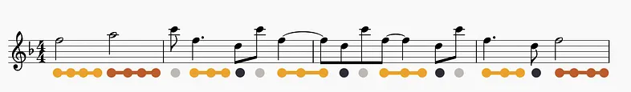

*La frase inicial de la regla Square LRRL, generada a partir del estado*
</div>

### 2. Dejar un Hueco en el Mapeo

Mapear el estado inicial a un **silencio**. Como los silencios coexisten con el color de fondo, contribuye a la conexión perceptiva entre las correspondencias visual y auditiva.

<div align="center">
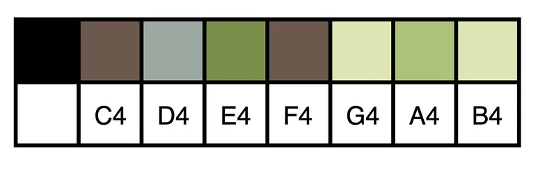

*Un mapeo de estados que ignora el estado inicial*
</div>

---

# 🏆 Mis Mejores Resultados

## Simetrías Simples en una Cuadrícula Cartesiana

Estos dos sistemas se realizan en una simple cuadrícula de 4 vías y ambos generan una simetría hermosa. Los cuatro estados están asignados a cuatro muestras de gamelán afinadas aproximadamente en D, F, La y C, con cuatro muestras de percusión asignadas a las cuatro direcciones.

<div align="center">
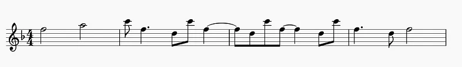
</div>

La hormiga se embarca en una aventura por el lado izquierdo, luego cruza hacia la derecha haciendo todas las mismas modificaciones pero en **orden exactamente inverso**, y finalmente vuelve al centro.

### 📹 Videos de Demostración

| Regla | Descripción | Video |
|:------|:------------|:-----:|
| **LRRL** (4 vías) | Dirección → percusión, Estados → gamelán | [▶️ Ver](https://www.youtube.com/watch?v=c8IfCod9xac) |
| **RRLL** (4 vías) | Misma configuración de audio, diferente regla | [▶️ Ver](https://www.youtube.com/watch?v=DqpTAxTjUi0) |

> En el código, LRRL sería: `estados = [-1,1,1,-1]`

---

## Simetría en una Cuadrícula Hexagonal

La regla **LLRR** hace algo realmente especial. Tiene algo parecido a un 'tema de apertura': un patrón que crea cuando el centro vuelve al estado inicial.

<div align="center">
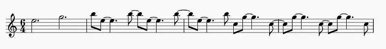
</div>

Se alterna entre estados creando una alternancia repetida entre un acorde de **Mi menor** y un acorde de **Do mayor**. Cuanto más tiempo se mantiene en un solo acorde, más tensión se acumula.

| Regla | Descripción | Video |
|:------|:------------|:-----:|
| **LLRR** (hexagonal) | Dirección → 6 percusiones, Estados → Do, Mi, Si, Re | [▶️ Ver](https://www.youtube.com/watch?v=Z1uIPUO5KnY) |

> En el código, LLRR sería: `estados = [-1,-1,1,1]`, donde -1 es un giro de 60° a la izquierda

---

## Colisiones

Para este sistema utilicé una cuadrícula hexagonal con la regla **L2 L2 L2 R R R**. Usé dos hormigas con direcciones de inicio diferentes para que sus autopistas chocaran. Tras la colisión interactúan de forma independiente, creando nuevos patrones.

| Regla | Descripción | Video |
|:------|:------------|:-----:|
| **L2L2L2RRR** (hexagonal) | Dos hormigas, 6 estados, colisiones | [▶️ Ver](https://www.youtube.com/watch?v=0kx7Eff3j3k) |

---

## Mi Favorita: Sistema de 8 Vías

Utiliza un sistema de 8 vías (cuadrícula cartesiana con movimiento diagonal). La regla básica es **R2 L2 R1 L1**, repetida dos veces. Comienza formando una autopista con un periodo de 13 puntos e interactúa maravillosamente al chocar consigo misma.

| Regla | Descripción | Video |
|:------|:------------|:-----:|
| **R2L2R1L1x2** (8 vías) | Dos hormigas, 8 estados, patrones de 13 puntos | [▶️ Ver](https://www.youtube.com/watch?v=NyJojIXyvL0) |

> La 'dirección' de cada hormiga se asigna a 8 muestras de percusión, y 7 de los 8 estados se asignan a notas: C, Eb, G, Bb (primera octava) y C, D, G (segunda octava).

---

# 📚 Referencias

| Recurso | Descripción |
|:--------|:------------|
| [**Langton's Ant Family Cellular Automata**](https://apps.apple.com/us/app/langtons-ant-family-cellular-automata/id1142104651) | App gratuita para iOS creada en 2016 ([GitHub](https://github.com/crashingbooth/LangtonsAnt)) |
| [**La hormiga de Langton - Wikipedia**](https://en.wikipedia.org/wiki/Langton%27s_ant) | Artículo con reglas fantásticas |
| [**Hexagonal Langton's Ant (brmtr)**](https://brtmr.de/2015/10/05/hexadecimal-langtons-ant-2.html) | Recurso sobre geometrías hexagonales |
| [**Andrew Byrne's Ants**](https://www.andrewbyrne.net/cellular-automata) | Piezas musicales usando mapeo direccional |
| [**Expensive Notes - Teensy Sequencer**](https://www.youtube.com/watch?v=6fnpbbUVeQE&ab_channel=ExpensiveNotes) | Secuenciador controlado con Launchpads y sintetizadores |
| [**OpenProcessing Sketch**](https://openprocessing.org/sketch/2055257) | Boceto usado en la mayoría de los vídeos |
| [**GitHub - Turing Explorer**](https://github.com/crashingbooth/turing-explorer) | Versión actualmente mantenida del código |

---

<div align="center">

**Construido con ❤️ usando p5.js, TypeScript y WebMIDI**

*[Genuary 2026](https://genuary.art/) - Día 18 & 19*

</div>